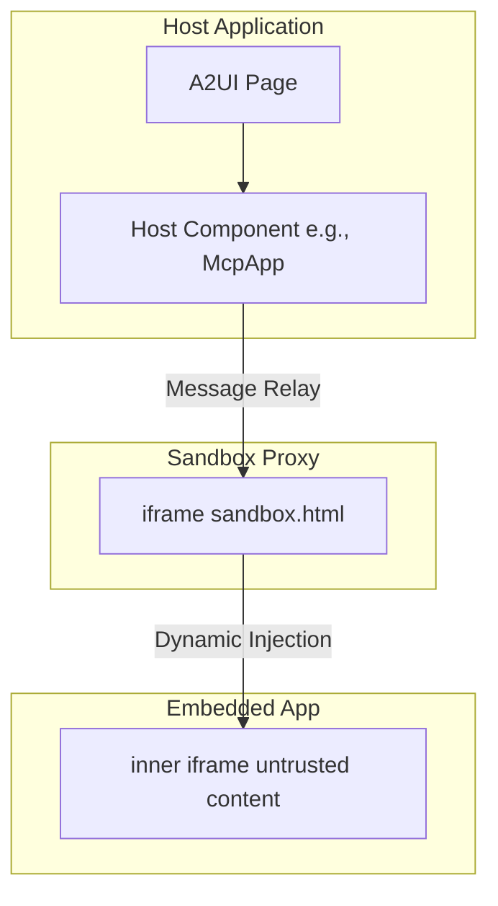
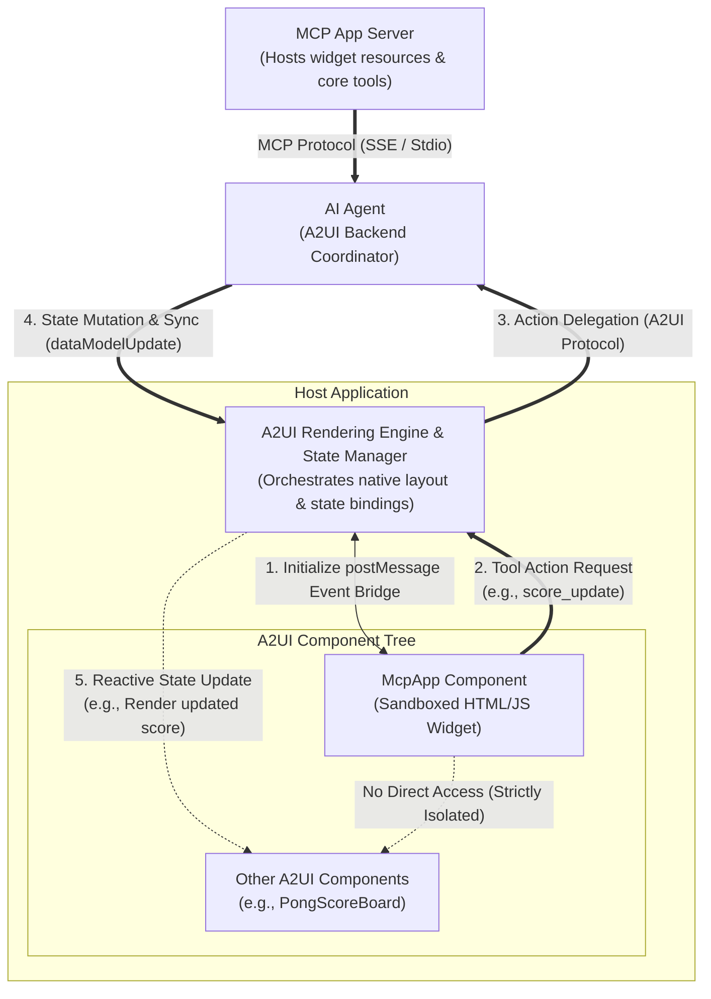

# MCP Apps Integration in A2UI Surfaces

This guide explains how **Model Context Protocol (MCP) Applications** are integrated and displayed within the **A2UI** surface, along with the security model and testing guidelines.

> NOTE: Looking for the core A2UI-over-MCP protocol? See [A2UI over MCP](a2ui_over_mcp.md) for how to return A2UI JSON payloads from MCP tool calls.

## Overview

The Model Context Protocol (MCP) allows MCP servers to deliver rich, interactive HTML-based user interfaces to hosts. A2UI provides a secure environment to run these third-party applications.


## Double-Iframe Isolation Pattern

To run untrusted third-party code securely, A2UI utilizes a **double-iframe** isolation pattern. This approach isolates raw DOM injection from the main application while maintaining a structured JSON-RPC channel.

### Security Rationale

Standard single-iframe sandboxing with `allow-scripts` is often bypassed if combined with `allow-same-origin`, which defeats the containerization. Any iframe with `allow-scripts` and `allow-same-origin` can escape its sandbox by programmatically interacting with its parent DOM or removing its own sandbox attribute.

To prevent this, A2UI strictly excludes `allow-same-origin` for the inner iframe where the third-party application runs.

### The Architecture

1.  **[Sandbox Proxy (`sandbox.html`)](https://github.com/a2ui-project/a2ui/blob/main/samples/client/shared/mcp_apps_inner_iframe/sandbox.html)**: An intermediate `iframe` served from the same origin. It isolates raw DOM injection from the main app while maintaining a structured JSON-RPC channel.
    - Permissions: **Do not sandbox** in the host template (e.g., [`mcp-app.ts`](https://github.com/a2ui-project/a2ui/blob/main/samples/community/client/lit/mcp-apps-in-a2ui-sample/mcp-app.ts) or [`mcp-apps-component.ts`](https://github.com/a2ui-project/a2ui/blob/main/samples/community/client/lit/mcp-apps-in-a2ui-sample/ui/custom-components/mcp-apps-component.ts)).
    - Host origin validation: Validates that messages come from the expected host origin.
2.  **Embedded App (Inner Iframe)**: The innermost `iframe`. Injected dynamically via `srcdoc` with restricted permissions.
    - Permissions: `sandbox="allow-scripts allow-forms allow-popups allow-modals"` (**MUST NOT** include `allow-same-origin`).
    - Isolation: Removes access to `localStorage`, `sessionStorage`, `IndexedDB`, and cookies due to unique origin.

### Physical Iframe Nesting



### End-to-End Architecture & Lifecycle Flow

The complete cycle—including layout tree hierarchy, completely separated backend actors (the Proxy Agent and the MCP Server), and how isolated third-party widgets interact reactively with their native siblings (e.g., the Pong game's scoreboard)—is detailed below:



#### How the Sibling Update Loop Works:

1. **Initialize postMessage Event Bridge (1)**: The host shell instantiates the double-iframe sandbox and establishes a secure message relay bridge with the `McpApp` component.
2. **Tool Action Request (2)**: When a user interacts with the sandboxed app (e.g., scores a point in the Pong game), the app triggers a tool action by posting a message over the postMessage bridge.
3. **Action Delegation (3)**: The host layout engine intercepts the action and delegates its execution to the `AI Proxy Agent` over the A2UI/A2A protocol. The agent optionally coordinates with the `MCP App Server` using the standard MCP Protocol (SSE / Stdio) if external calculation or resources are required.
4. **State Mutation & Sync (4)**: The agent processes the action, mutates the master session state, and pushes a `dataModelUpdate` back to the host state manager.
5. **Reactive State Update (5)**: The host updates its local store, triggering a reactive update on sibling A2UI components (such as native scoreboards or displays) bound to that state path. Direct communication between the sandboxed component and native sibling elements is strictly blocked to maintain containerization security.

## Usage / Code Example

The MCP Apps component typically resolves to a `custom` node in the A2UI catalog. Here is how a developer might use it in their code.

### 1. Register within the Catalog

You must register the component in your catalog application. For example, in Angular:

```typescript
import {Catalog} from '@a2ui/web_core/v0_9';
import {z} from 'zod';
import {McpApp} from './mcp-app';

export const DEMO_CATALOG = new Catalog(
  'a2ui.org:a2ui/v0.9/mcp_app_catalog.json',
  [
    {name: 'McpApp', component: McpApp, schema: z.any()},
  ]
);
```

### 2. Usage in A2UI Message

In the Host or Agent context, send an A2UI message that translates to this custom node.

```json
{
  "type": "custom",
  "name": "McpApp",
  "properties": {
    "content": "<h1>Hello, World!</h1>",
    "title": "My MCP App"
  }
}
```

If the content is complex or requires encoding, you can pass a URL-encoded string:

```json
{
  "type": "custom",
  "name": "McpApp",
  "properties": {
    "content": "url_encoded:%3Ch1%3EHello%2C%20World!%3C%2Fh1%3E",
    "title": "My MCP App"
  }
}
```

## Communication Protocol

Communication between the Host and the embedded inner iframe is facilitated via a structured JSON-RPC channel over `postMessage`.

- **Events**: The Host Component listens for a `SANDBOX_PROXY_READY_METHOD` message from the proxy.
- **Bridging**: An `AppBridge` handles message relaying. Developers (specifically the MCP App Developer inside the untrusted iframe) can call tools on the MCP server using `bridge.callTool()`.
- **The Host**: Resolves callbacks (e.g., specific resizing, Tool results).

### Limitations

Because `allow-same-origin` is strictly omitted for the innermost iframe, the following conditions apply:

- The MCP app **cannot** use `localStorage`, `sessionStorage`, `IndexedDB`, or cookies. Each application runs with a unique origin.
- Direct DOM manipulation by the parent is blocked. All interactions must proceed via message passing.

## Prerequisites

To run the samples, ensure you have the following installed:

- **Python 3.10+** — Required for the agent and MCP server backends
- **[uv](https://docs.astral.sh/uv/)** — Fast Python package manager (used to run all Python samples)
- **Node.js 18+** and **Yarn** — Required for building and running the sample client apps within this monorepo workspace.
- **A `GEMINI_API_KEY`** — Required by all ADK-based agents. Get one from [Google AI Studio](https://aistudio.google.com/apikey)

> [!NOTE]
> **Package Manager Usage:** Running the built-in sample applications within the A2UI repository requires Yarn as configured by Corepack workspaces. For your own regular usage and standalone projects outside this repository, use the package manager of your choice (e.g. npm, pnpm).

> ⚠️ **Environment variable setup**: You can either export `GEMINI_API_KEY` in your shell or create a `.env` file in each agent directory. The agents use `dotenv` to load `.env` files automatically.
>
> ```bash
> # Option 1: Export in shell
> export GEMINI_API_KEY="your-api-key-here"
>
> # Option 2: Create .env file in the agent directory
> echo 'GEMINI_API_KEY=your-api-key-here' > .env
> ```

## Samples

There are two primary samples demonstrating MCP Apps integration. Each sample requires running **multiple terminals** — one for each backend service and one for the client.

---

### Sample 1: MCP App Standalone Sample (Lit Client & ADK Agent)

This sample verifies the sandbox with a Lit-based client and an ADK-based A2A agent.

#### Step 1: Start the Agent

In a separate terminal, navigate to the agent directory and start the agent:

```bash
cd samples/agent/adk/mcp-apps-in-a2ui-sample
uv run agent.py
```

The agent will run on `http://localhost:8000`.

#### Step 2: Start the Client

In a new terminal, navigate to the client directory and start the dev server (requires building the Lit renderer first):

```bash
cd samples/client/lit/mcp-apps-in-a2ui-sample
yarn install
yarn dev
```

The client starts at `http://localhost:5173/`.

#### Step 3: Open in Browser

Open your browser and navigate to `http://localhost:5173/`. You should see the A2UI interface loading the MCP App.

**What to expect**: A page loading the MCP App in a sandboxed iframe. Clicking the "Call Agent Tool" button inside the iframe will trigger an action that is handled by the agent.

---

### Sample 2: MCP Apps (Calculator + Pong) (Angular Client + MCP Server + Proxy Agent)

This sample verifies the sandbox with an Angular-based client, an MCP Proxy Agent, and a remote MCP Server. It requires **three** backend processes.

#### Step 1: Start the MCP Server (Calculator)

```bash
cd samples/community/mcp/mcp-apps-calculator/
uv run .
```

The MCP server starts on `http://localhost:8000` (or another port if 8000 is occupied, e.g. `uv run . --port 8001`) using SSE transport.

#### Step 2: Start the MCP Apps Proxy Agent

In a **new terminal**:

```bash
cd samples/community/agent/adk/mcp_app_proxy/
export GEMINI_API_KEY="your-key"  # or use a .env file
uv run .
```

The proxy agent starts on `http://localhost:10006` by default.

#### Step 3: Build and Start the Angular Client

First, build the renderer packages by running `yarn build:all` at the **repository root directory**:

```bash
# Run at repository root
yarn build:all
```

Then, in a **new terminal**, navigate to the client directory, install local dependencies, and start the app (which automatically bundles the sandbox iframe proxy and starts the development server):

```bash
# Navigate to the client directory
cd samples/community/client/angular/

# Install local dependencies
yarn install

# Start the app and bundle sandbox
yarn start mcp_calculator
```

> ⚠️ **`yarn build:all` is required**: `yarn build:all` compiles the A2UI renderer packages that the Angular app depends on. Running `yarn start mcp_calculator` automatically bundles the sandbox proxy into the Angular project's public assets before starting the server.

The client starts at `http://localhost:4200/`.

#### Step 4: Open in Browser

Navigate to:

```
http://localhost:4200/?disable_security_self_test=true
```

**What to expect**: A set of smart chips to load calculator app or pong app will be rendered. Both apps run in their own sandboxed iframes.

|                                                 Calculator App                                                 |                                 Pong App                                  |
| :------------------------------------------------------------------------------------------------------------: | :-----------------------------------------------------------------------: |
|  |  |

---

## URL Options for Testing

For testing purposes, you can opt-out of the security self-test by using specific URL query parameters.

### `disable_security_self_test=true`

This query parameter allows you to bypass the security self-test that verifies iframe isolation. This is useful for debugging and testing environments where the double-iframe setup may not pass strict origin checks (e.g., `localhost` development).

Example usage:

```
http://localhost:4200/?disable_security_self_test=true
```

## Troubleshooting

| Problem                                           | Solution                                                                                         |
| ------------------------------------------------- | ------------------------------------------------------------------------------------------------ |
| `GEMINI_API_KEY environment variable not set`     | Export the key or add a `.env` file in the agent directory                                       |
| Python version error on `restaurant_finder` agent | Install Python 3.13+ (required by that sample's `pyproject.toml`)                                |
| `yarn build:renderer` fails                       | Make sure you ran `yarn install` first in `samples/client/lit/`                                  |
| Angular client shows blank page                   | Ensure you ran `yarn build:sandbox` before `yarn start`                                          |
| MCP app iframe doesn't load                       | Check that both the MCP server (port 8000) and proxy agent (port 10006) are running              |
| `ng serve` not found                              | Run `yarn install` to install dev dependencies including `@angular/cli`                          |
| "URL with hostname not allowed"                   | Angular 21 restricts allowed hosts. Use `localhost` (the default) — do not pass `--host 0.0.0.0` |
| Security self-test fails in dev                   | Add `?disable_security_self_test=true` to the URL                                                |
