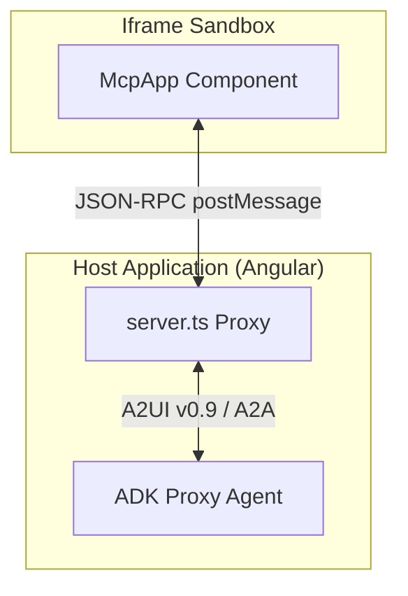

# Engineering Design Document: Migrating Pong and MCP Apps to A2UI v0.9

This document outlines the design and implementation plan to migrate the **Pong game** and **MCP Apps** integration within the Angular client and ADK agent from A2UI protocol version **v0.8** to **v0.9**.

---

## 1. Objective

Upgrade the A2UI communication payload and handshake protocol between the Angular client (`mcp_calculator`) and the MCP App Proxy Agent from **v0.8** to **v0.9**. This transition shifts the architecture from a structured-output-first model to a token-efficient, prompt-first design that is easier for LLMs to generate and validate.

---

## 2. Background & Architecture

The A2UI-over-MCP integration utilizes a **double-iframe isolation pattern** to run third-party HTML/JS applications (like Pong or Calculator) securely.

A2UI v0.9 introduces several schema simplifications:

- **`createSurface`** replaces `beginRendering`, adding explicit catalog negotiation via `catalogId`.
- **`updateComponents`** replaces `surfaceUpdate` using a flat component list with a `"component"` discriminator.
- **`updateDataModel`** replaces `dataModelUpdate` using standard JSON objects instead of adjacency lists.



---

## 3. Detailed Design & Changes

### 3.1. Session State Version Tracking

To support multiple versions concurrently and allow tools to dynamically select the correct payload format, we must track the negotiated version in the session state.

- **Target File:** [agent_executor.py](file:///usr/local/google/home/ytanahashi/Documents/Projects/a2ui/samples/community/agent/adk/mcp_app_proxy/agent_executor.py)
- **Design:** Store the active A2UI version resolved by `try_activate_a2ui_extension` in the session's state delta.

```python
# In McpAppProxyAgentExecutor._prepare_session
await runner.session_service.append_event(
    session,
    Event(
        ...
        actions=EventActions(
            state_delta={
                _A2UI_ENABLED_KEY: True,
                _A2UI_CATALOG_KEY: a2ui_catalog,
                _A2UI_EXAMPLES_KEY: examples,
                "system:a2ui_version": active_ui_version, # New tracking key
            }
        ),
    ),
)
```

---

### 3.2. Upgrading Tool Payloads

Tools must evaluate the negotiated A2UI version and return the corresponding payload structure.

- **Target File:** [tools.py](file:///usr/local/google/home/ytanahashi/Documents/Projects/a2ui/samples/community/agent/adk/mcp_app_proxy/tools.py)
- **Design:**
  - **A2UI v0.9 Payload for `get_pong_app_a2ui_json`**:
    ```json
    [
      {
        "createSurface": {
          "surfaceId": "pong_surface",
          "catalogId": "a2ui.org:a2ui/v0.9/mcp_app_catalog.json"
        }
      },
      {
        "updateDataModel": {
          "surfaceId": "pong_surface",
          "path": "/",
          "value": {
            "pong_state": {
              "player_score": 0,
              "cpu_score": 0
            }
          }
        }
      },
      {
        "updateComponents": {
          "surfaceId": "pong_surface",
          "components": [
            {
              "id": "pong_layout_root",
              "component": "PongLayout",
              "mcpComponent": {
                "id": "mcp_app_root",
                "component": "McpApp",
                "content": "url_encoded:...",
                "title": "Neon Pong",
                "allowedTools": ["score_update"]
              },
              "scoreboardComponent": {
                "id": "scoreboard_root",
                "component": "PongScoreBoard",
                "playerScore": {"path": "/pong_state/player_score"},
                "cpuScore": {"path": "/pong_state/cpu_score"}
              }
            }
          ]
        }
      }
    ]
    ```
  - **A2UI v0.9 Payload for `score_update`**:
    ```json
    [
      {
        "updateDataModel": {
          "surfaceId": "pong_surface",
          "path": "/",
          "value": {
            "pong_state": {
              "player_score": new_player_score,
              "cpu_score": new_cpu_score
            }
          }
        }
      }
    ]
    ```

---

### 3.3. Client-Side Negotiation

The Angular proxy server needs to advertise support for v0.9 and request the v0.9 extension.

- **Target File:** [server.ts](file:///usr/local/google/home/ytanahashi/Documents/Projects/a2ui/samples/community/client/angular/projects/mcp_calculator/src/server.ts)
- **Design:**
  - Update `supportedCatalogIds` in the metadata:
    ```typescript
    supportedCatalogIds: [
      'https://a2ui.org/specification/v0_9/standard_catalog_definition.json',
      'a2ui.org:a2ui/v0.9/mcp_app_catalog.json',
    ];
    ```
  - Update `X-A2A-Extensions` header:
    ```typescript
    headers.set('X-A2A-Extensions', 'https://a2ui.org/a2a-extension/a2ui/v0.9');
    ```

---

## 4. Verification & Testing Plan

1. **Backend Integration Tests:** Run the proxy agent and verify it returns a v0.9 `agent-card.json` containing the v0.9 catalog reference.
2. **E2E Playtest:**
   - Start the MCP Server, Proxy Agent, and Angular Client.
   - Access the Angular Client at `http://localhost:4200/?disable_security_self_test=true`.
   - Open the Pong game and ensure:
     - The game loads correctly in the isolated iframe.
     - Scoring a point successfully updates the native Angular `PongScoreBoard` component via `updateDataModel`.
